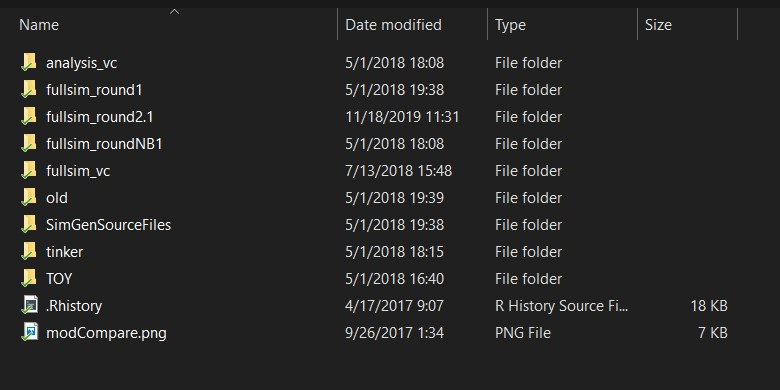
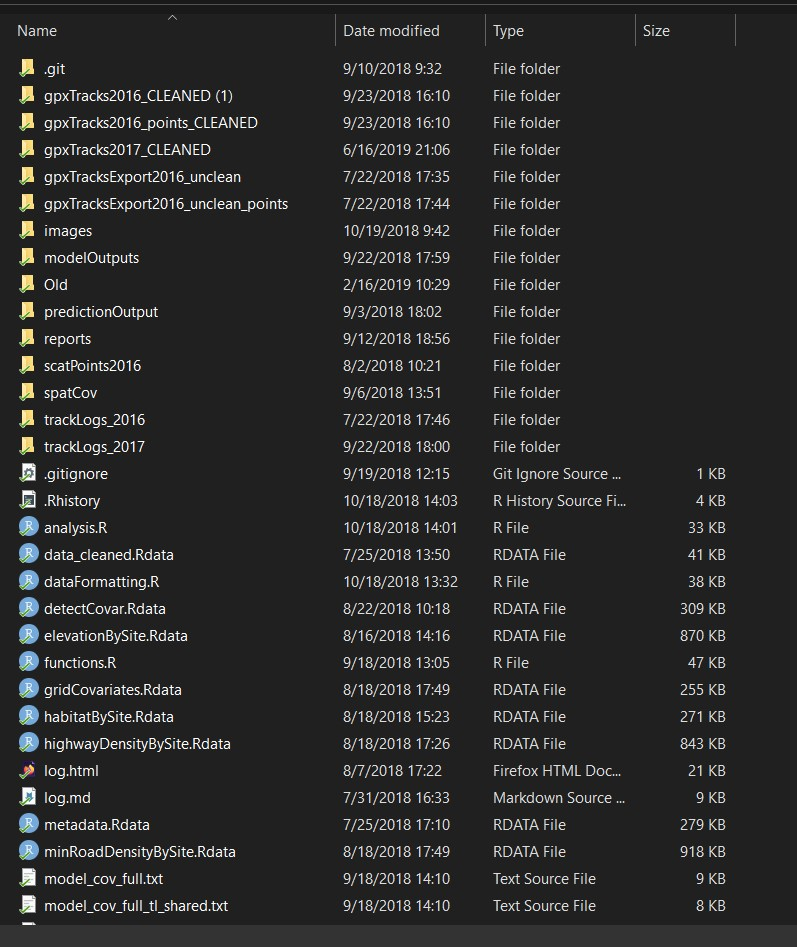
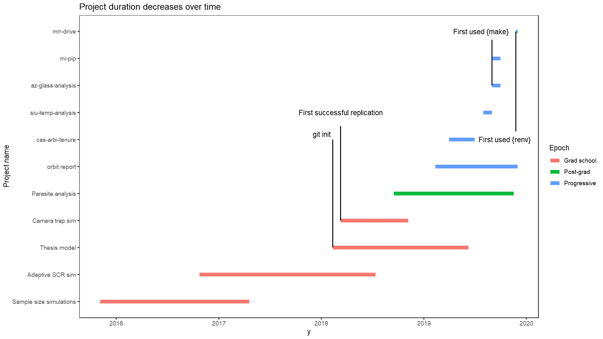
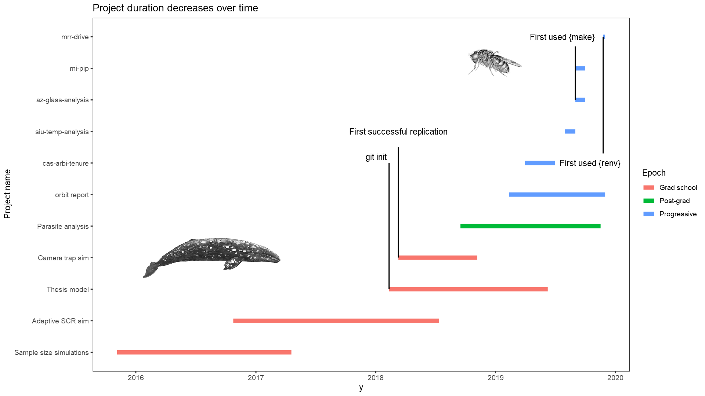

```{r include = FALSE}
knitr::opts_knit$set(root.dir = here::here())
knitr::opts_chunk$set(comment = NA)
```

## 

<iframe data-src = "https://rstats.wtf/" width = 100% height = 700px></iframe>

<aside class='notes'>
Hi everyone, thank you, etc. 

Clone the project in and compile all.

Reproducibility x organization.

Inspiration: jenny bryan, jim, Not so standard deviations 2016

Clearly been thought about a lot before -- this is nothing new!
</aside>

##

<div class='flexparent'>
<div class=flexchild>

</div>
<div class=flexchild marginwider>
<div style='height: 20%;'>
</div>
* Great podcast (I've listened up to ep. 17)
* Project design comes up sometimes!
</div>
</div>

## 

<aside class='notes'>
So this is more *descriptive*, and less *prescriptive*; 

I wasn't taught this in school, and if you're like me it would have been nice to
get more exposure to this
</aside>

<div class=flexparent>
<div class='flexchild zoom'>
<a href = "C:\Users\AlecW\Google Drive\Active\Cornell\Moose\Data\Simulations\Adaptive Sampling\AS_R_files">

</a>
</div>
<div class='flexchild zoom'>
<a href = "C:\Users\AlecW\Google Drive\Active\Cornell\Moose\Data\Simulations\Scat_Counting">

</a>
</div>
</div>

<div>

</div>

## Grad school code

What's especially wrong with it?

*Modus operandi*

> "I'm the only one who's going to *really* use this, so I can be lazy about the organization."


## Bad design

*Probably* not reproducible

* Not especially well documented, particularly at first
* Ambiguity in file naming & authoritative versions
* Projects aren't self-contained
* Nothing about R install or packages were recorded!
* Hard paths, etc.

## Tools 

and their "induced philosophies"

`git`, `.Rproj`, `make`, `renv`

<aside class='notes'>
I picked up a number of tools along the way, and I feel
</aside>

##

### Characteristics of implementations <br /> leading to good project design

* Intentional
* Codified
* Explicit 


## Project evolution



<aside class='notes'>
Started using git around 2018, after a project under my belt.


</aside>

## Project evolution



<aside class='notes'>
My projects life spans had turned from whales to fruit flies;

Evolution could occur much more rapidly.

Setup script made me really consider what my projects looked like.
</aside>

## `git`


## `git`

* ESSENTIAL to any workflow, collaborative or otherwise
* Reduces or eliminates uncertainty in code changes over time
* A feeling of safety to build upon code -- nothing is lost!

## `git` and intentionality

* Introducing objects into the repository is a **deliberate** process
    * What files are worth putting into the repo?
    * If they aren't entered in, do others depend on it?
    * Do you have a way to get it to them somehow?
* Eliminates dependence on `v1.0`, `v2.0`, `Archive/`, `Old/` etc.

Paraphrased:

> git slows you down, but in a good way that makes you think about the project <br/> -- Roger Peng, Not So Standard Deviations

## `git` and codification

* Commit message, tags, GitHub all allow commentary to build on code.
* Commit messages are **required**; the committer must consider
the implications of changes at least once.
* GitHub really encourages the use of README files


## `git` and explicitness

* Plenty of space to write
* Code history is its own explicit record

## `git`

## R projects / packages


## R projects / packages

Intentional: 

* Requires the user to define an entry point for their project
* Packges impose a regular structure on the folders contained in a project

Codified:

* `.Rproj` clearly demarcates an R project, and itself contains some settings about the project.

Explicit: 

* R projects and packages discourage the use of absolute paths (`{here}`)
* R projects and packages discourage cross-folder project structures

## `renv`

Released 2019-10-26 (?) -- Kevin Ushey author, maintainer

Succeeds `packrat`

Package management system

Reproducibility miracle

## `renv` usage

```r
# Initialize the project with some folders, changes to .Rprofile, etc.
renv::init()

# Take snapshots of the package dependencies at intervals
renv::snapshot()

# From another workstation, after cloning
renv::restore()
```

## `renv`

Intentional:

* `renv::consent()` a literal function in the package
* Forces the user to confront what packages are necessary for the project

## `renv`

Codified:

* `renv::snapshot()` aids the user in writing down the R version, the CRAN repository, and package versions
* Could have been done before (`sessionInfo()`), but try restoring from that!

```
R version 3.5.3 (2019-03-11)
Platform: x86_64-w64-mingw32/x64 (64-bit)
Running under: Windows 10 x64 (build 18363)

Matrix products: default

locale:
[1] LC_COLLATE=English_United States.1252  LC_CTYPE=English_United States.1252   
[3] LC_MONETARY=English_United States.1252 LC_NUMERIC=C                          
[5] LC_TIME=English_United States.1252    

attached base packages:
[1] stats     graphics  grDevices datasets  utils     methods   base     

other attached packages:
[1] Cairo_1.5-10         cowplot_1.0.0        curl_4.2            
[4] dplyr_0.8.3          magrittr_1.5         ggplot2_3.2.1       
[7] readxl_1.3.1         RevoUtils_11.0.3     RevoUtilsMath_11.0.0

loaded via a namespace (and not attached):
 [1] Rcpp_1.0.3       highr_0.8        cellranger_1.1.0 pillar_1.4.2    
 [5] compiler_3.5.3   tools_3.5.3      zeallot_0.1.0    digest_0.6.23   
 [9] evaluate_0.14    lifecycle_0.1.0  tibble_2.1.3     gtable_0.3.0    
[13] pkgconfig_2.0.3  rlang_0.4.2      cli_1.1.0        magick_2.2      
[17] yaml_2.2.0       xfun_0.11        stringr_1.4.0    withr_2.1.2     
[21] knitr_1.26       vctrs_0.2.0      revealjs_0.9     grid_3.5.3      
[25] tidyselect_0.2.5 glue_1.3.1       R6_2.4.1         fansi_0.4.0     
[29] rmarkdown_1.18   farver_2.0.1     purrr_0.3.3      backports_1.1.5 
[33] scales_1.1.0     htmltools_0.4.0  assertthat_0.2.1 colorspace_1.4-1
[37] renv_0.8.3       utf8_1.1.4       stringi_1.4.3    lazyeval_0.2.2  
[41] munsell_0.5.0    crayon_1.3.4 
```
## `renv`

Instead:

```{r}
cat(paste0(readLines('renv.lock'), collapse = '\n'))
```

## `renv`

Explicit:

* Package versions and sources are *exact*
* Can specify non-standard repositories (i.e. GitHub)

## `GNU make`

## `GNU make`

My favorite workflow addition

Software from April 1973

Orchestrates the creation of **targets** by evaluating **dependencies'**
modification times, using **recipes** written by you.

*(Also see `drake`)*

## `GNU make`

<div class=bigcode>
```
target: dependency_1 dependency_2 dependency_n
    recipe
```
</div>

## `GNU make`

The makefile that determines this very project!

```{r}
cat(paste0(readLines('makefile'), collapse = '\n'))
```

## `GNU make`

I:

* The workflow is deliberately constructed.
* Forces the user to confront the reproducibility of the project.
    * If you can't `make all` from scratch, your pipeline is broken!

C:

* The workflow is **written down**.
    * Much better than lexical ordering (i.e. `01_load.R`, `02_clean.R`, `03_analyze.R`).

E:

* The workflow is **precise**
    * All inputs and outputs are defined, and the chain of events are elaborated in great detail.
    
## `GNU make`

UNIX software design philosophy

* Write programs that do one thing and do it well.
* Write programs to work together.

## `make` this presentation
