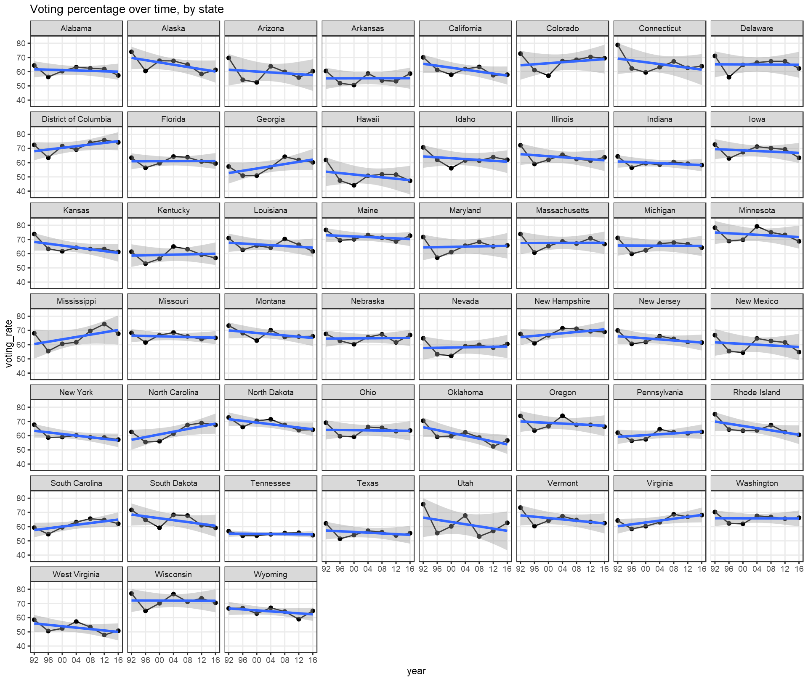

#### A short work-up of U.S. Census data on voting proportions of voting-eligible citizenry

```{r, include = FALSE}
knitr::opts_chunk$set(comment = NA, echo = TRUE)
knitr::opts_knit$set(root.dir = here::here())

library(tidyr)
library(broom)
library(dplyr)
library(vroom)
library(ggplot2)
library(patchwork)
library(knitr)


```

```{r}
voting = vroom('output/voting_rates.tsv')
models = readRDS('output/model_tbl.RDS')

yr = substr(sort(voting$year), start = 3, stop = 4) %>% unique
```

## What is the slope and magnitude of the year coefficient of each state?


## ModelFits

### Interaction model

This model is a simple one that fits an individual intercept and slope for each
state. It is suggestive of trend over time assuming that states are completely
independent of one another. Using the slope coefficients we can quantify the
trend over time for each state.

$$
y \sim N(\mu, \sigma)\\
\mu = \beta_0 + \beta_1(year) + \beta_2(state) + \beta_3(state * year)
$$



```{r}
pick = which(models$description == "voting_rate ~ -1 + year * state")
tidy_interaction = models$model_fit[[pick]] %>% tidy %>% mutate(type = case_when(
  grepl(pattern = '(^year)', x = term) ~ 'slope',
  T ~ 'intercept'
))

slopes = filter(tidy_interaction, type == 'slope')
slopes = slopes %>% mutate(direction = case_when(
  estimate > 0 ~ "Increasing",
  estimate < 0 ~ "Decreasing"
))

kable(slopes, digits = 2)
```

### Random effects model

A random intercept and slope is specified for each state, and a fixed effect by
year. The variation in the year slope is small such that the estimated standard
deviation of the population of coefficients is 0.004, and the simpler random
intercept for each state model is more parsimonious by AIC. It suggests that the
overall trend to decrease over time is adequately explained by the fixed effect
for year and a random effect for state, and the slopes don't actually have great 
variance by state under this model.

$$
y \sim N(\mu, \sigma)\\
\mu = \beta_0 + \alpha_{0,s} + \alpha{1,s}*year + \beta_1*year\\
\alpha{0,s} \sim N(0,\Sigma)\\
\alpha{1,s} \sim N(0,\Sigma)
$$

Compare the output of the random intercepts & slope model (first) to just the random intercepts (second) 
```{r}
pick = which(models$description == "voting_rate ~ year + (year | state)")
re_mod_1 = models$model_fit[[pick]]
re_mod_1
```

```{r}
pick = which(models$description == "voting_rate ~ year + (1 | state)")
re_mod_2 = models$model_fit[[pick]]
re_mod_2
```

Nevertheless, the functional difference of these models is minor; the fitted
results are functionally identical.

```{r, fig.height=10}
augs = bind_rows(list("r_intercept + r_slope" = augment(re_mod_1), "r_intercept" = augment(re_mod_2)), .id = 'model')

overall = ggplot(augs) + 
  geom_point(aes(x = year, y = voting_rate)) + 
  geom_line(aes(x = year, y = .fitted, color = model)) + 
  
  facet_wrap(~state) 

one_state = ggplot(augs %>% filter(state == "Ohio")) +
  geom_point(aes(x = year, y = voting_rate)) + 
  geom_line(aes(x = year, y = .fitted, color = model)) + 
  facet_wrap(~state)

overall / one_state + plot_layout(heights = c(8,2), guides = 'collect') & theme_bw() & theme(legend.position = 'bottom')
```

### Random intercepts model -- best performing by AIC

Here, a random intercept is specified for each state, but also each year. The
year fixed effect is still included, but the random effects absorb most of the
variation. It is interesting in its own right to observe that 1992 appears to be
a year of notably high voter participation followed by a reduction and a
stabilization, in aggregate. It implies a different story than the
independent-state model, suggesting that states tend to behave similarly within
years.

$$
y \sim N(\mu, \sigma) \\
\mu = \beta_0 + \alpha_{0,s} + \alpha_{1,y} + \beta_2*year \\
\alpha_{0,s} \sim N(0,\Sigma)\\
\alpha_{1,y} \sim N(0,\Sigma)
$$

